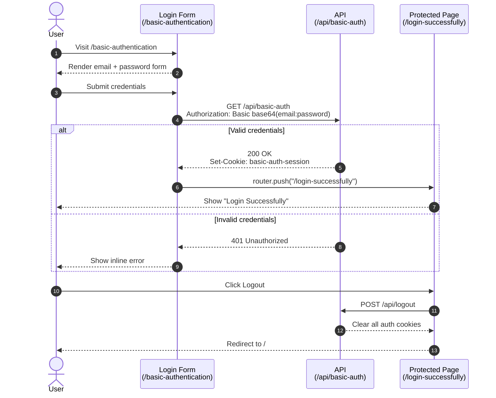

# Authentication Flows

This document explains how each authentication flow in this app works and how it is implemented in the codebase. It is written to be approachable for developers at any level.

---

## Basic Authentication

### What is Basic Authentication?

Basic Authentication is one of the simplest ways for an HTTP client (e.g. a browser) to prove who it is to a server.

The idea:

1. The client wants to access a protected resource.
2. The client sends its **username** and **password** with the request, packed into one HTTP header:
   ```
   Authorization: Basic <base64(username:password)>
   ```
3. The server decodes the header and decides: is this user allowed?

That's it. There is no token, no cryptographic signature, no session negotiation. It is just credentials in a header.

> Important: Base64 is **encoding**, not encryption. Anyone who sees the header can recover the password. Basic auth is only safe over HTTPS.

### Two ways the credentials can be collected

- **Native browser dialog** — if the server returns `401 Unauthorized` with a `WWW-Authenticate: Basic realm="..."` header, the browser shows its built-in username/password popup. The user types creds and the browser retries automatically.
- **Custom login form** — the page renders its own form, the client-side code reads the inputs, base64-encodes them and sends the `Authorization` header itself.

**This app uses the custom login form approach** so we have full control over the UI and error messages (no native popup).

### High-level flow in this app



After login, the cookie is what keeps the user "signed in" for the protected page. Logout deletes that cookie.

### Routes and pages

| Path                       | Type                | Purpose                                                                 |
| -------------------------- | ------------------- | ----------------------------------------------------------------------- |
| `/`                        | Page                | Home with the auth-flow Select + Go button.                             |
| `/basic-authentication`    | Page (server)       | Renders the login form. If already logged in, redirects to success.     |
| `/api/basic-auth`          | Route handler (GET) | Validates the `Authorization` header. Sets the session cookie on success. |
| `/login-successfully`      | Page (server)       | Protected page. Redirects to `/` if no auth cookie is present.          |
| `/api/logout`              | Route handler (POST)| Clears every auth cookie (basic, jwt, …).                               |

### Files

```
app/
├── page.tsx                                          # Home: Select + Go
├── basic-authentication/
│   ├── page.tsx                                      # Server page: guard + render form
│   └── _components/login-form.tsx                    # Client form: encode creds + fetch
├── api/
│   ├── basic-auth/route.ts                           # Validate creds, set session cookie
│   └── logout/route.ts                               # Clear all auth cookies
└── login-successfully/
    ├── page.tsx                                      # Server page: cookie check + render
    └── _components/logout-button.tsx                 # Client button: call /api/logout
lib/
└── auth.ts                                           # Shared list of auth cookie names
```

### How a request flows step-by-step

#### 1. User selects "Basic Authentication" on `/`

`app/page.tsx` is a small client component with a `<Select>` and a `Go` button. Clicking Go calls `router.push("/basic-authentication")`.

#### 2. The login page renders

`app/basic-authentication/page.tsx` is a **server component**. Before rendering, it reads cookies:

```ts
const cookieStore = await cookies();
if (cookieStore.get(BASIC_AUTH_COOKIE)?.value) {
  redirect("/login-successfully");
}
```

If the user already has a valid session cookie, they skip the form and go straight to the success page. Otherwise the page renders the `<LoginForm />`.

#### 3. The form posts credentials

`app/basic-authentication/_components/login-form.tsx` is a client component. On submit it:

```ts
const credentials = btoa(`${email}:${password}`);
const response = await fetch("/api/basic-auth", {
  headers: { Authorization: `Basic ${credentials}` },
});
```

- `btoa(...)` produces the base64 string that sits inside the `Authorization` header.
- We use `fetch` (not a native form `POST`) so we can stay on the page and show inline errors on `401`.

#### 4. The server validates the credentials

`app/api/basic-auth/route.ts` does five things:

1. Reads the `authorization` header.
2. Confirms it starts with `Basic ` and base64-decodes the rest with `atob`.
3. Splits the decoded string at the first `:` — everything before is the username, everything after is the password (passwords may contain `:`).
4. Compares against the expected demo credentials.
5. On success, returns `200 OK` and sets the session cookie:

```ts
response.cookies.set({
  name: BASIC_AUTH_COOKIE,        // "basic-auth-session"
  value: encoded,                  // the base64 token
  httpOnly: true,                  // not readable by JS
  sameSite: "lax",
  path: "/",
});
```

On failure it returns plain `401 Unauthorized` JSON. **No `WWW-Authenticate` header** — that header is what triggers the native browser popup, and we want our custom form to handle errors instead.

#### 5. Client redirects to the success page

If `response.ok`, the form calls `router.push("/login-successfully")`.

If not, the form sets an `error` state and shows "Invalid email or password." inline.

#### 6. The success page is guarded

`app/login-successfully/page.tsx` is a server component. It reads cookies and redirects to `/` if **none** of the auth cookies are set:

```ts
const isAuthenticated = AUTH_COOKIES.some(
  (name) => cookieStore.get(name)?.value,
);
if (!isAuthenticated) redirect("/");
```

This is important: without this guard, anyone could navigate to `/login-successfully` directly.

#### 7. Logout

The Logout button calls `POST /api/logout`. The server deletes every auth cookie by setting `maxAge: 0`:

```ts
for (const name of AUTH_COOKIES) {
  response.cookies.set({ name, value: "", path: "/", maxAge: 0 });
}
```

Then the client also clears `localStorage`/`sessionStorage` and navigates to `/` with `router.replace`. The next visit to `/login-successfully` finds no cookie and redirects back to home.

### Demo credentials

```
email:    admin@example.com
password: password
```

These are hardcoded in `app/api/basic-auth/route.ts` for the demo only.

### Security notes

These apply to a real-world implementation, not this demo:

- **Always use HTTPS.** Base64 is reversible; on plain HTTP your password is effectively in cleartext.
- **Don't store credentials in cookies.** This demo stores the base64 token to keep things simple. A real app should store an opaque session ID and look the user up server-side.
- **`btoa` / `atob` only handle Latin-1.** For non-ASCII credentials, encode through `TextEncoder` first.
- **Validate against a real user store.** Compare hashed passwords (e.g. bcrypt/argon2), not equality with a constant.
- **Rate-limit and lock out** repeated failed attempts.

### Quick test checklist

1. Go to `/` → choose **Basic Authentication** → click **Go**.
2. Enter `admin@example.com` / `password` → you land on `/login-successfully`.
3. Try a bad password → inline error appears, no redirect.
4. While on `/login-successfully`, click **Logout** → you return to `/`.
5. Manually visit `/login-successfully` after logout → you are redirected back to `/`.
6. Manually visit `/basic-authentication` while logged in → you are redirected to `/login-successfully`.
