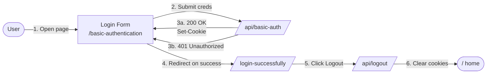
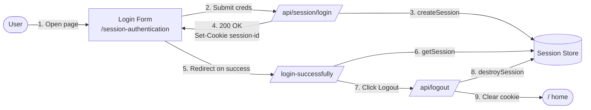

# Authentication Flows

This document explains how each authentication flow in this app works and how it is implemented in the codebase. It is written to be approachable for developers at any level.

---

## Basic Authentication

### What is Basic Authentication?

Basic Authentication is one of the simplest ways for an HTTP client (e.g. a browser) to prove who it is to a server.

The idea:

1. The client wants to access a protected resource.
2. The client sends its **username** and **password** with the request, packed into one HTTP header:
   ```
   Authorization: Basic <base64(username:password)>
   ```
3. The server decodes the header and decides: is this user allowed?

That's it. There is no token, no cryptographic signature, no session negotiation. It is just credentials in a header.

> Important: Base64 is **encoding**, not encryption. Anyone who sees the header can recover the password. Basic auth is only safe over HTTPS.

### Two ways the credentials can be collected

- **Native browser dialog** — if the server returns `401 Unauthorized` with a `WWW-Authenticate: Basic realm="..."` header, the browser shows its built-in username/password popup. The user types creds and the browser retries automatically.
- **Custom login form** — the page renders its own form, the client-side code reads the inputs, base64-encodes them and sends the `Authorization` header itself.

**This app uses the custom login form approach** so we have full control over the UI and error messages (no native popup).

### High-level flow in this app



**Login (happy path):** open the form → submit email + password → API validates and sets `basic-auth-session` cookie → client redirects to `/login-successfully`.

**Login (failure):** API returns `401` and the form shows an inline error.

**Logout:** the success page calls `POST /api/logout`, which clears every auth cookie, then the client navigates back to `/`.

After login, the cookie is what keeps the user "signed in" for the protected page. Logout deletes that cookie.

### Routes and pages

| Path                       | Type                | Purpose                                                                 |
| -------------------------- | ------------------- | ----------------------------------------------------------------------- |
| `/`                        | Page                | Home with the auth-flow Select + Go button.                             |
| `/basic-authentication`    | Page (server)       | Renders the login form. If already logged in, redirects to success.     |
| `/api/basic-auth`          | Route handler (GET) | Validates the `Authorization` header. Sets the session cookie on success. |
| `/login-successfully`      | Page (server)       | Protected page. Redirects to `/` if no auth cookie is present.          |
| `/api/logout`              | Route handler (POST)| Clears every auth cookie (basic, jwt, …).                               |

### Files

```
app/
├── page.tsx                                          # Home: Select + Go
├── basic-authentication/
│   ├── page.tsx                                      # Server page: guard + render form
│   └── _components/login-form.tsx                    # Client form: encode creds + fetch
├── api/
│   ├── basic-auth/route.ts                           # Validate creds, set session cookie
│   └── logout/route.ts                               # Clear all auth cookies
└── login-successfully/
    ├── page.tsx                                      # Server page: cookie check + render
    └── _components/logout-button.tsx                 # Client button: call /api/logout
lib/
└── auth.ts                                           # Shared list of auth cookie names
```

### How a request flows step-by-step

#### 1. User selects "Basic Authentication" on `/`

`app/page.tsx` is a small client component with a `<Select>` and a `Go` button. Clicking Go calls `router.push("/basic-authentication")`.

#### 2. The login page renders

`app/basic-authentication/page.tsx` is a **server component**. Before rendering, it reads cookies:

```ts
const cookieStore = await cookies();
if (cookieStore.get(BASIC_AUTH_COOKIE)?.value) {
  redirect("/login-successfully");
}
```

If the user already has a valid session cookie, they skip the form and go straight to the success page. Otherwise the page renders the `<LoginForm />`.

#### 3. The form posts credentials

`app/basic-authentication/_components/login-form.tsx` is a client component. On submit it:

```ts
const credentials = btoa(`${email}:${password}`);
const response = await fetch("/api/basic-auth", {
  headers: { Authorization: `Basic ${credentials}` },
});
```

- `btoa(...)` produces the base64 string that sits inside the `Authorization` header.
- We use `fetch` (not a native form `POST`) so we can stay on the page and show inline errors on `401`.

#### 4. The server validates the credentials

`app/api/basic-auth/route.ts` does five things:

1. Reads the `authorization` header.
2. Confirms it starts with `Basic ` and base64-decodes the rest with `atob`.
3. Splits the decoded string at the first `:` — everything before is the username, everything after is the password (passwords may contain `:`).
4. Compares against the expected demo credentials.
5. On success, returns `200 OK` and sets the session cookie:

```ts
response.cookies.set({
  name: BASIC_AUTH_COOKIE,        // "basic-auth-session"
  value: encoded,                  // the base64 token
  httpOnly: true,                  // not readable by JS
  sameSite: "lax",
  path: "/",
});
```

On failure it returns plain `401 Unauthorized` JSON. **No `WWW-Authenticate` header** — that header is what triggers the native browser popup, and we want our custom form to handle errors instead.

#### 5. Client redirects to the success page

If `response.ok`, the form calls `router.push("/login-successfully")`.

If not, the form sets an `error` state and shows "Invalid email or password." inline.

#### 6. The success page is guarded

`app/login-successfully/page.tsx` is a server component. It reads cookies and redirects to `/` if **none** of the auth cookies are set:

```ts
const isAuthenticated = AUTH_COOKIES.some(
  (name) => cookieStore.get(name)?.value,
);
if (!isAuthenticated) redirect("/");
```

This is important: without this guard, anyone could navigate to `/login-successfully` directly.

#### 7. Logout

The Logout button calls `POST /api/logout`. The server deletes every auth cookie by setting `maxAge: 0`:

```ts
for (const name of AUTH_COOKIES) {
  response.cookies.set({ name, value: "", path: "/", maxAge: 0 });
}
```

Then the client also clears `localStorage`/`sessionStorage` and navigates to `/` with `router.replace`. The next visit to `/login-successfully` finds no cookie and redirects back to home.

### Demo credentials

```
email:    admin@example.com
password: password
```

These are hardcoded in `app/api/basic-auth/route.ts` for the demo only.

### Security notes

These apply to a real-world implementation, not this demo:

- **Always use HTTPS.** Base64 is reversible; on plain HTTP your password is effectively in cleartext.
- **Don't store credentials in cookies.** This demo stores the base64 token to keep things simple. A real app should store an opaque session ID and look the user up server-side.
- **`btoa` / `atob` only handle Latin-1.** For non-ASCII credentials, encode through `TextEncoder` first.
- **Validate against a real user store.** Compare hashed passwords (e.g. bcrypt/argon2), not equality with a constant.
- **Rate-limit and lock out** repeated failed attempts.

### Quick test checklist

1. Go to `/` → choose **Basic Authentication** → click **Go**.
2. Enter `admin@example.com` / `password` → you land on `/login-successfully`.
3. Try a bad password → inline error appears, no redirect.
4. While on `/login-successfully`, click **Logout** → you return to `/`.
5. Manually visit `/login-successfully` after logout → you are redirected back to `/`.
6. Manually visit `/basic-authentication` while logged in → you are redirected to `/login-successfully`.

---

## Session-Based Authentication

### What is Session-Based Authentication?

Session-based auth is the classic web login pattern. Instead of sending credentials with every request, the user logs in **once**, the server creates a **session record** on its side, and gives the client a small **session ID** in a cookie. From then on, the cookie is the proof of identity.

The server is the source of truth: as long as the session ID maps to a valid record on the server, the user is "logged in." Logout simply deletes the record.

Compared to Basic Authentication:

| | Basic Auth | Session Auth |
|---|---|---|
| Credentials sent | On **every** request | Only on **login** |
| Server state | None | Session store (memory / Redis / DB) |
| Identifier | The credentials themselves | An opaque session ID |
| Logout | Client just stops sending the header | Server deletes the session record |
| Scales horizontally | Yes (stateless) | Needs a shared session store |

### High-level flow



**Login (happy path):** form POSTs creds → API validates → creates a record in the session store → returns a session ID in an httpOnly cookie → client redirects to `/login-successfully`.

**Login (failure):** API returns `401`; the form shows an inline error.

**Logout:** the success page calls `POST /api/logout`, which destroys the session record on the server and clears every auth cookie, then the client navigates to `/`.

### Routes and pages

| Path                          | Type                 | Purpose                                                                  |
| ----------------------------- | -------------------- | ------------------------------------------------------------------------ |
| `/session-authentication`     | Page (server)        | Login form. If a valid session cookie exists, redirects to success.      |
| `/api/session/login`          | Route handler (POST) | Validates credentials, creates a session record, sets the cookie.        |
| `/api/session/logout`         | Route handler (POST) | Destroys this user's session and clears the cookie.                      |
| `/api/session/me`             | Route handler (GET)  | Returns the currently logged-in user (handy for client-side checks).     |
| `/api/logout`                 | Route handler (POST) | Generic logout: destroys server session **and** clears every auth cookie. |

### Files

```
app/
├── session-authentication/
│   ├── page.tsx                                   # Server page: guard + render form
│   └── _components/login-form.tsx                 # Client form: POST credentials
└── api/
    └── session/
        ├── login/route.ts                         # Validate creds, create session, set cookie
        ├── logout/route.ts                        # Destroy session, clear cookie
        └── me/route.ts                            # Return current user
lib/
├── auth.ts                                        # Shared cookie names (incl. SESSION_COOKIE)
└── session-store.ts                               # In-memory session store (id → user)
```

### Step-by-step walkthrough

#### 1. The session store

`lib/session-store.ts` holds an in-memory `Map<sessionId, SessionData>`. Each record has the user info, a creation time, and an expiry. We attach the map to `globalThis` so it survives Next.js dev hot-reloads:

```ts
const store: SessionStore =
  globalForSessions.__sessionStore ?? new Map();
```

API:

```ts
createSession({ userId, email })   // → returns { id, ... } and stores it
getSession(id)                     // → returns record or null (also expires it)
destroySession(id)                 // → removes the record
```

> In production you'd swap this for Redis, a database table, or a managed session service. The interface stays the same.

#### 2. The login page

`app/session-authentication/page.tsx` is a server component. Before rendering it checks the cookie **against the session store** (not just whether the cookie exists):

```ts
const session = getSession(cookieStore.get(SESSION_COOKIE)?.value);
if (session) redirect("/login-successfully");
```

That's the key difference from Basic Auth: the server has authoritative state. A stale or revoked session ID won't pass `getSession`.

#### 3. The login form

`app/session-authentication/_components/login-form.tsx` POSTs the credentials as JSON:

```ts
const response = await fetch("/api/session/login", {
  method: "POST",
  headers: { "Content-Type": "application/json" },
  body: JSON.stringify({ email, password }),
});
```

On `200` it redirects to `/login-successfully`; on `401` it shows an inline error.

#### 4. The login API

`app/api/session/login/route.ts` does:

1. Parse JSON body.
2. Validate `email` / `password` against the demo credentials.
3. `createSession(...)` → gets a fresh, random session ID via `crypto.randomUUID()`.
4. Sets the cookie:

```ts
response.cookies.set({
  name: SESSION_COOKIE,           // "session-id"
  value: session.id,
  httpOnly: true,                  // not readable by JS (mitigates XSS)
  sameSite: "lax",                 // mitigates CSRF on top-level navigations
  path: "/",
  maxAge: SESSION_TTL_MS / 1000,   // matches the server-side expiry
});
```

#### 5. The success page

`app/login-successfully/page.tsx` is shared by every flow. For session auth it validates against the store:

```ts
const hasValidSession = Boolean(
  getSession(cookieStore.get(SESSION_COOKIE)?.value),
);
if (!hasBasicAuth && !hasValidSession) redirect("/");
```

#### 6. Logout

Two endpoints can log a session user out, both call `destroySession`:

- `POST /api/session/logout` — for a session-only logout.
- `POST /api/logout` — the global logout used by the success page; destroys the server session **and** clears every auth cookie. This is what the Logout button calls so the same button works regardless of which flow logged the user in.

### Demo credentials

```
email:    admin@example.com
password: password
```

Hardcoded in `app/api/session/login/route.ts`.

### Security notes

- **Use HTTPS in production** — the session ID in the cookie is a bearer token; if someone steals it, they are the user.
- **`httpOnly` + `sameSite: lax`** — set on the cookie to limit XSS theft and most CSRF.
- **Rotate session IDs on privilege change** (e.g. login, role change) to defend against session fixation.
- **Don't store secrets in the session record** — store only what you need (user id, role, etc.).
- **Persistent store in production** — an in-memory Map is fine for one Node process. With multiple instances or restarts, use Redis / DB.
- **TTL and idle timeout** — expire sessions both absolutely (e.g. 24h) and after inactivity.
- **Hash passwords** — never compare plain strings against a database; use `bcrypt`/`argon2`.

### Quick test checklist

1. Go to `/` → choose **Session Authentication** → click **Go**.
2. Enter `admin@example.com` / `password` → land on `/login-successfully`.
3. Open DevTools → Application → Cookies: you should see `session-id` (httpOnly).
4. Click **Logout** → you return to `/` and the `session-id` cookie is gone.
5. Manually visit `/login-successfully` after logout → redirected to `/` (server can't find the session in the store, even if you re-add a fake cookie).
6. Manually visit `/session-authentication` while logged in → redirected to `/login-successfully`.
